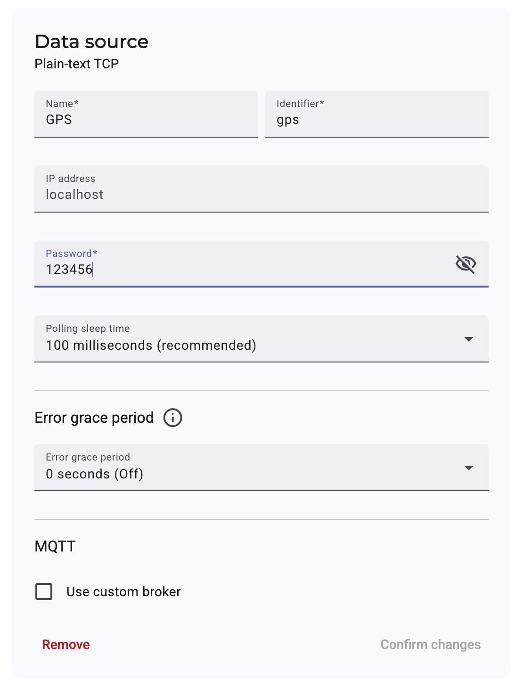
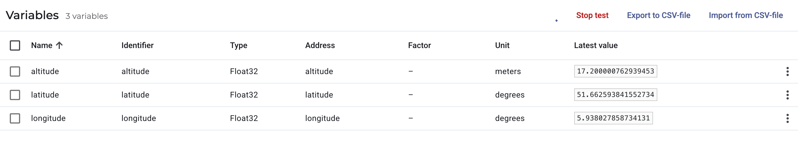
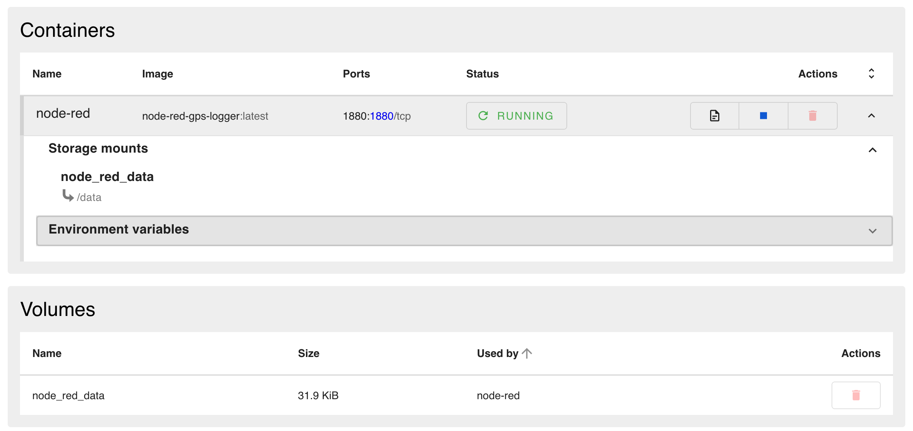

# Edge App - GPS Data Logger for SecureEdge Pro

This project provides a ready-to-deploy solution for logging GPS data on IXON's SecureEdge Pro device (**Cellular** and **Combi** variants only). It uses Node-RED to collect GPS data and send it to IXON Cloud via the Plain-text TCP protocol.

> **Note:** This solution is only available on SecureEdge Pro devices with cellular or combi modules. It requires an open sky environment and a connected GPS antenna.

## Features

- Collects real-time GPS data from SecureEdge Pro hardware
- Node-RED flows for data processing and sending data via Plain-text TCP
- Seamless integration with IXON Cloud for remote monitoring and logging
- Docker-based deployment for easy installation and updates

## Prerequisites

- SecureEdge Pro (Cellular or Combi variant)
- **Firmware version 5.7 or higher is required**
- GPS antenna connected and device placed with open sky access
- IXON Cloud account
- Access to the SecureEdge Pro local web interface
- Ensure your environment is properly set up by following this guide: [Running custom Docker applications on the SecureEdge Pro](https://support.ixon.cloud/s/article/Running-custom-Docker-applications-on-the-SecureEdge-Pro).

## Quick Start

### 1. Download and Adjust to Your SecureEdge Pro

- Download or clone this project to your local machine.
- If you do not use the default LAN IP address for your SecureEdge Pro, update the IP address in the following files to match your device's LAN IP:
  - `buildkitd-secure-edge-pro.toml`
  - `build_and_push_containers.sh`
  - `build_and_push_containers.cmd`
  - `node-red/flows.json`

### 2. Build and Push Containers

- For Unix-based systems:
  ```bash
  ./setup-buildx-env.sh
  ./build_and_push_containers.sh
  ```
- For Windows:
  ```cmd
  setup-buildx-env.cmd
  build_and_push_containers.cmd
  ```

### 3. Deploy on SecureEdge Pro

- Access the SecureEdge Pro local web interface.
- Create and configure the following container:
  - **node-red-gps-logger**: Expose port `1880:1880`, mount volume `node_red_data` to `/data`
- Start the container.

### 4. Access Node-RED

- In IXON Cloud, create an HTTP Web Server to access the Node-RED web interface.
- Open Node-RED and review or adjust the flow for GPS data collection and transmission.

### 5. Configure IXON Cloud: Data Source and Variables

#### a. Add a Plain-text TCP Data Source

1. In IXON Cloud, go to your device and add a new data source of type **Plain-text TCP**.
2. Enter a name (e.g., `GPS Logger`).
3. Leave the IP address empty if using IXagent, otherwise enter your machine's IP.
4. Set a password (at least 6 characters) — you will use this in Node-RED.
5. (Optional) Set polling sleep time (e.g., 100ms) and error grace period as needed.
6. Click **Add** to create the data source.

Refer to the screenshot below for the correct data source setup:


#### b. Add Variables via CSV Import

1. Under your new data source, go to **Variables**.
2. Click **Import from CSV-file** (top right).
3. Use the provided CSV file: `ixon_cloud_settings/logger-api_variables.csv` to import all required variables for GPS logging (e.g., `latitude`, `longitude`, `altitude`, etc.).
4. Review the imported variables and their addresses. Make sure these match the addresses used in your Node-RED flow.
5. Click **Push config to device** to activate the changes.

Refer to the screenshot below for the correct variable import setup:


### 6. Set Up Node-RED on SecureEdge Pro

1. In the SecureEdge Pro local web interface, create a new container for Node-RED:
   - Image: Use the Node-RED image provided in this project.
   - Port mapping: `1880:1880`
   - Volume: `node_red_data` → `/data`

Refer to the screenshot below for the correct container setup:



2. Start the container and access the Node-RED web interface (via IXON Cloud HTTP Web Server or local network).
3. Open the Node-RED flow and ensure it:
   - Collects GPS data from the hardware
   - Establishes a TCP connection to the edge gateway on port `9230`
   - Uses the same addresses as configured in IXON Cloud variables

### 7. Test and Visualize GPS Data

- In IXON Cloud, use the **Run test** feature on your data source to verify that data is being received from Node-RED.
- Use IXON Cloud dashboards to visualize and analyze the logged GPS data in real time or historically.

## Troubleshooting

- Ensure the GPS antenna is properly connected and the device has a clear view of the sky.
- Only Cellular and Combi variants of SecureEdge Pro support GPS logging.
- For further help, consult the [IXON Support Portal](https://support.ixon.cloud/).

## License

See [LICENSE.md](LICENSE.md) for license information.
